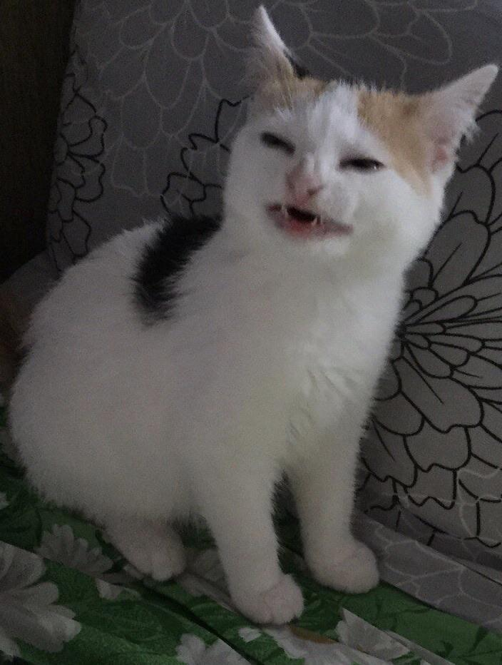

# Digitalización de Señales 2022-1

Hola a todos c:

## Imágenes

## Tablas

| Cabecera 1 | Cabecera 2 | Cabecera 3 |
|------------|------------|------------|
|oal         | lao        | ola        |
|aquí hay    |una         | tabla      |

## Código

**Código** de ejemplo, variables simbólicas

~~~

syms t
%Variable simbólica
y_symb = cos(t)

%Function handle
y_fh = @(t) cos(t)

~~~

## Enlaces

Para más información, [Github](https://github.com/Iliaki)